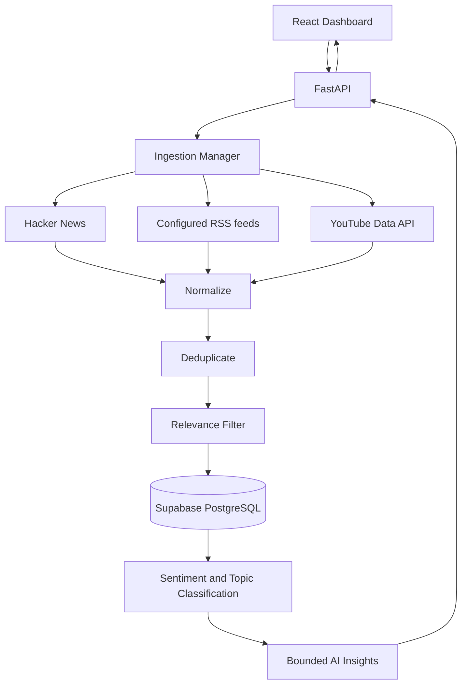

# Architecture

## Request and Data Flow

`POST /api/search` returns a non-persisting preview. `POST /api/collect` calls the same ingestion path, persists accepted mentions, classifies the stored rows, creates a summary, and returns the saved records. Read endpoints query the stored PostgreSQL data.

## Components

- `frontend/src/`: React/Vite dashboard, source controls, request states, analytics charts, mention filters, link actions, and summary provider label.
- `backend/app/api/`: FastAPI routes, validation schemas, dependencies, and collect/analytics orchestration.
- `backend/app/ingestion/`: source contract, manager, HTTP retry layer, normalizing and processing pipeline.
- `backend/app/ingestion/sources/`: independent Hacker News, RSS/Atom, and YouTube adapters.
- `backend/app/repositories/mentions.py`: idempotent writes, filters, pagination, and PostgreSQL aggregate queries.
- `backend/app/nlp/classifier.py`: deterministic local sentiment/topic classifier.
- `backend/app/ai/`: Ollama/Gemini provider abstraction, bounded context builder, output validation, deterministic fallback.
- `backend/app/scheduler.py`: opt-in APScheduler worker, separate from the HTTP process.

## Ingestion, Quality, and Resilience

Each source implements the source adapter contract and returns a common raw mention schema. The manager processes each source independently, so a failed adapter is reported in `source_failures` without discarding successful records. Configurable request timeouts, bounded retries, and backoff limit stalled source calls. Limits are validated at API boundaries.

The processing pipeline normalizes text, timestamps, and URLs; removes exact duplicate `(source, external_id)` values and identical content hashes in the current batch; then rejects records with no text or no keyword relevance. Persistence is idempotent using the database unique constraint `uq_mentions_source_external_id`.

The YouTube adapter limits search results, batches metadata requests, caps comment pages per video, and stops on quota exhaustion. Hacker News uses its public search API; RSS feeds are explicitly configured, fetched independently, and filtered locally. No source is scraped by bypassing a source's restrictions.

## Database

PostgreSQL table `public.mentions` stores:

- UUID primary key, source, external ID, searched keyword
- Title, content, author, URL, published and collected timestamps
- JSONB engagement, normalized text, content hash
- Relevance score/reason
- Sentiment/topic labels and confidence scores
- Created/updated timestamps

The source/external ID unique constraint protects idempotent inserts. Additional indexes support keyword/date, source/date, collection time, content hash, and sentiment/topic queries. Alembic migrations are separate from application startup; migrations must target an explicitly chosen database. Supabase credentials remain backend-only.

## NLP and AI

The deterministic classifier labels each accepted mention locally, without per-item LLM requests. The summary context contains aggregate sentiment/topic counts and no more than three short representative positive and three negative examples. Individual mention rows are not sent wholesale to a language model.

Provider priority:

1. Local Ollama with the configured installed model; inference timeout defaults to 60 seconds and readiness probes are capped at five seconds.
2. Gemini Developer API using the pinned stable `gemini-3.8-flash` model when the configured key is present.
3. Deterministic aggregate-based fallback.

Provider content is validated against the insight schema. Network errors, throttling, service failures, and invalid responses fall through instead of failing the collection request. No grounding tools are requested. Gemini free use depends on a no-billing Free-tier project and current account quotas.

## Security and Validation

- Pydantic validates request fields, limits, source names, and response data.
- `.env` is ignored by Git; `.env.example` has no real credentials.
- Provider secrets and database URLs never enter the frontend bundle or API responses.
- CORS is configured from server environment; production must set the frontend's exact origin.
- HTTP clients use bounded timeouts/retries, and source/AI failures are logged by sanitized error type.
- The connection checker performs read-only database queries; it does not migrate or modify schema.

## Scheduling

Scheduled ingestion is disabled by default and runs as a separate process/Compose profile. It coalesces missed runs, allows one cycle at a time, isolates failures per keyword, uses bounded source limits, and does not call an AI summary for every scheduled cycle.

## Deployment

The intended no-cost prototype topology is Vercel Hobby static frontend, Render Free FastAPI web service, and Supabase Free PostgreSQL. Vercel should use `frontend` as root, `npm run build`, `dist`, and `VITE_API_BASE_URL`. The backend container binds to `0.0.0.0:$PORT` (defaults to 8000) and uses `/health` for its health check. Configure `DATABASE_URL`, provider secrets, and `CORS_ORIGINS` in the hosting secret/environment manager.

Free tiers have material availability/usage limits: Render Free web services sleep on inactivity and have ephemeral filesystems and monthly instance-hour quotas; Supabase Free can pause after inactivity and includes 500 MB database storage. Current terms are linked in the README. No public deployment is currently configured.
